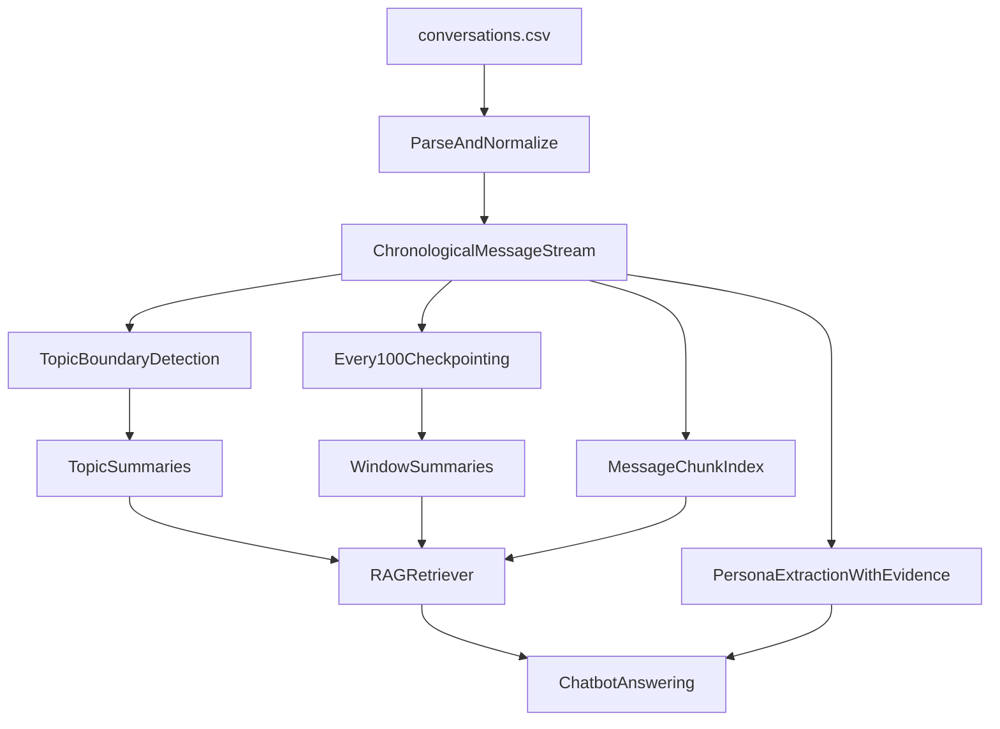

# AI/ML Engineer Intern Assignment Solution

This repository delivers the requested system using a notebook-first Python workflow over `conversations.csv`.

Repository: [https://github.com/kevincostner17/ai-ml-intern-assignment](https://github.com/kevincostner17/ai-ml-intern-assignment)

## Deliverables Included
- `solution.ipynb`: end-to-end implementation in notebook format.
- `rag_persona_system.py`: reusable pipeline logic shared by notebook and chatbot.
- `app.py`: simple chatbot UI (Streamlit) using RAG + persona data.
- `RUN_AND_USAGE.md`: separate step-by-step execution and usage guide.
- `SUBMISSION_CHECKLIST.md`: final submission tracker.
- `SUBMISSION_EMAIL_TEMPLATE.md`: ready-to-send email draft.

## What The System Does

### 1) Chronological processing
- Parses conversations row-by-row from `conversations.csv`.
- Treats each row as a day-level conversation block.
- Splits into ordered message units (`User 1`, `User 2`) and assigns global chronological IDs.

### 2) Topic checkpoints (core requirement)
- Processes messages in chronological order.
- Detects topic shifts via rolling TF-IDF similarity drift between recent and upcoming windows.
- Adds topic boundaries when semantic similarity drops below threshold with guardrails:
  - minimum topic length,
  - cooldown after split.
- Produces per-topic outputs:
  - message ranges,
  - topic summary,
  - highlights,
  - evidence message IDs.

### 3) Every-100-message checkpoints
- Independently creates summaries for fixed windows:
  - `1-100`, `101-200`, etc.
- Stored separately from topic checkpoints.

### 4) Retrieval (RAG)
- Dual retrieval strategy:
  1. summary-level retrieval over topic + 100-message checkpoints,
  2. chunk-level retrieval over raw message chunks.
- Query answering merges both retrieval outputs in one grounded response.

### 5) Persona extraction
- Extracts persona in structured JSON with categories:
  - habits,
  - personal facts,
  - personality traits,
  - communication style.
- Persona entries include evidence references (`message_id`, speaker, quote-style claim, confidence).
- Built only from observed conversation signals.

## Output Artifacts
Generated in `artifacts/`:
- `messages.parquet`
- `messages.csv`
- `topic_checkpoints.json`
- `message_checkpoints_100.json`
- `message_chunks.json`
- `persona.json`

## Chatbot Questions Supported
- "What kind of person is this user?"
- "What are their habits?"
- "How do they talk?"

## Project Flow

## Setup and Run
Follow `RUN_AND_USAGE.md` for exact commands.

## Cloud Hosting URL
- Deployed chatbot URL: `https://ai-ml-intern-assignment-juxn3tt24kqswxgvfyaxya.streamlit.app/`

## Demo Links
- Loom video: `<YOUR_LOOM_LINK>`
- Screenshots folder/link: `<YOUR_SCREENSHOTS_LINK>`
